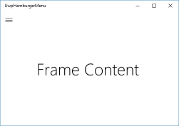
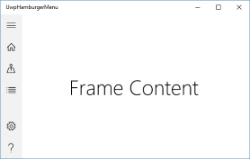
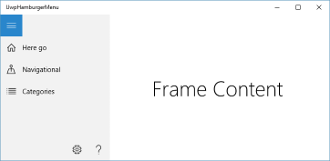
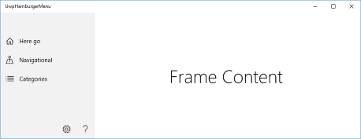

# Hamburger Menu for UWP
A simple hamburger menu implementation for Universal Windows Platform.

Assuming you have a UWP project created with Blank App template simply add `Shell.xaml` and `Shell.xaml.cs` to your project and modify `App.xaml.cs` like this:

```C#
protected override void OnLaunched(LaunchActivatedEventArgs e)
{
    var shell = Window.Current.Content as Shell;

    // Do not repeat app initialization when the Window already has content,
    // just ensure that the window is active
    if (shell == null)
    {
        // Create a Shell to host a Frame to act as the navigation context and navigate to the first page
        shell = new Shell();

        shell.PresentationFrame.NavigationFailed += OnNavigationFailed;

        if (e.PreviousExecutionState == ApplicationExecutionState.Terminated)
        {
            //TODO: Load state from previously suspended application
        }

        // Place the frame in the current Window
        Window.Current.Content = shell;
    }

    if (shell.PresentationFrame.Content == null)
    {
        // When the navigation stack isn't restored navigate to the first page,
        // configuring the new page by passing required information as a navigation
        // parameter
        shell.PresentationFrame.Navigate(typeof(MainPage), e.Arguments);
    }
    // Ensure the current window is active
    Window.Current.Activate();
}

```

And then you'll get this:

Snapped view


Narrow view


Square view


Wide view
